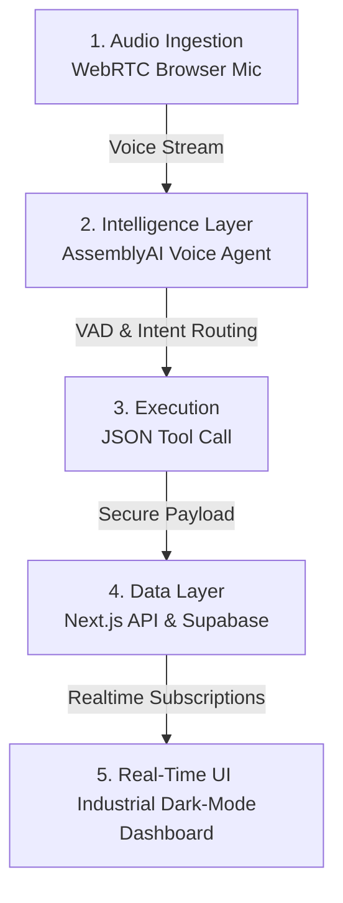

# 🦺 HazVox AI
**The Real-Time Voice Incident Commander for High-Risk Industrial Sites.**

[](https://lablab.ai/event/assemblyai-voice-agent-hackathon)
[](https://nextjs.org/)
[](https://supabase.com/)

> **Live Demo:** [Deploy URL Here] | **Pitch Video:** [YouTube Link Here]

## ⚠️ The Problem: Hands are Tied, Fines are High
In construction, mining, and heavy manufacturing, workers wear heavy PPE (gloves, safety harnesses) and operate in high-noise environments. They cannot type on tablets to log near-misses or hazardous conditions. Manual reporting is delayed or skipped, leading to non-compliance fines ($3B+ annually in the US) and elevated workers' compensation premiums.

## 🎙️ The Solution: HazVox AI
HazVox AI is a hands-free, voice-activated compliance and dispatch agent. By utilizing AssemblyAI's ultra-low latency Voice Agent API, field workers can verbally report hazards through heavy background noise. The agent extracts structured data via JSON-Schema tool calling and instantly auto-fills OSHA compliance forms on a live command center dashboard.

---

## 🏆 System Design

### 1. Business Value (ROI)
* **Cost Reduction:** Reduces workers' compensation insurance premiums by 5-15% by lowering incident reporting friction.
* **Compliance:** Prevents heavy OSHA/HSE fines by turning delayed, end-of-day manual paperwork into instant, automated logs.
* **Market Expansion:** High willingness-to-pay ($150-$300/seat/month B2B SaaS) targeting general contractors and enterprise fleet operators.

### 2. Application of Technology (AssemblyAI Integration)
We bypassed generic chatbot implementations to build a fully integrated hardware-to-dashboard pipeline using AssemblyAI:
* **Voice Agent API:** Manages end-to-end turn-taking and conversational state.
* **Universal-3 Pro (Noise Rejection):** Accurately transcribes industry-specific jargon (e.g., "Hydraulic leak on equipment 402") even over simulated construction background noise.
* **JSON-Schema Tool Calling:** The agent executes a `report_safety_hazard` tool, passing structured arguments (`hazard_level`, `equipment_id`, `location`) directly to our Supabase database in milliseconds.

### 3. Originality
Moving away from oversaturated consumer bots (like interview coaches or customer service IVRs), HazVox AI targets a critical, ignored, offline B2B workflow where visual attention is restricted and hands-free operation is mandatory.

---

## 🏗️ System Architecture

1. **Audio Ingestion:** Worker speaks via standard WebRTC browser mic.
2. **Intelligence Layer:** AssemblyAI Voice Agent handles Voice Activity Detection (VAD) and intent routing.
3. **Execution:** Agent triggers a JSON Tool Call.
4. **Data Layer:** Next.js API route securely ingests the payload and writes to Supabase.
5. **Real-Time UI:** Supabase Realtime Subscriptions instantly push the hazard alert to the industrial dark-mode dashboard.

---


---


---

## Future Features

### Gemini AI Triage
- Automated severity classification from raw audio transcripts and telemetry.
- AI-driven root-cause diagnostic hypotheses based on asset history.
- Unstructured voice note parsing into structured compliance records.

### Slack Dispatch
- Rich Block Kit notifications with dynamic hazard badges and location data.
- Interactive workflow controls for incident acknowledgment and assignment.
- Automated escalation loops for critical tickets breaching SLAs.
---

## Development & Deployment Challenges

### Netlify & CI/CD Limitations
- **Free Tier Constraints:** Strict build minutes, function timeout limits, and bandwidth caps on Netlify's free tier restrict heavy asset bundling and automated testing pipelines.


### Supabase & Gateway Restrictions
- **Kong API Gateway Interception:** Direct database-to-Edge Function calls via `pg_net` consistently failed with `401 INVALID_API_KEY` errors due to Supabase's strict external API gateway routing and token policies.
- **In-Database AI & Notification Execution Limits:** Attempting to execute Google Gemini analysis and Slack webhook dispatches natively from database triggers proved unviable due to runtime execution limits and header rejections.
- **Architectural Pivot:** Bypassed gateway roadblocks by decoupling real-time workflows and shifting asynchronous AI enrichment and Slack dispatching to an external orchestration layer (n8n).

---

## 🚀 Quick Start (Local Setup)

To run HazVox AI locally for judging or development:

### Prerequisites
* Node.js 18+
* AssemblyAI API Key
* Supabase Account (Free Tier)

### 1. Clone & Install
```bash
git clone [https://github.com/yourusername/hazvox-ai.git](https://github.com/yourusername/hazvox-ai.git)
cd hazvox-ai
npm install

2. Environment Variables
Create a .env.local file in the root directory:
# AssemblyAI
ASSEMBLYAI_API_KEY=your_api_key_here

# Supabase
NEXT_PUBLIC_SUPABASE_URL=your_supabase_project_url
NEXT_PUBLIC_SUPABASE_ANON_KEY=your_supabase_anon_key

3. Database Setup (Supabase)
Run the following SQL in your Supabase SQL Editor to create the incidents table:
CREATE TABLE incidents (
  id UUID DEFAULT uuid_generate_v4() PRIMARY KEY,
  hazard_level TEXT NOT NULL,
  equipment_id TEXT,
  description TEXT NOT NULL,
  location TEXT,
  status TEXT DEFAULT 'open',
  created_at TIMESTAMP WITH TIME ZONE DEFAULT timezone('utc'::text, now())
);
-- Enable Realtime
alter publication supabase_realtime add table incidents;

4. Run the Development Server
npm run dev

Navigate to http://localhost:3000 to access the Command Center Dashboard.
📝 License
This project is licensed under the MIT License - ensuring full compliance with lablab.ai hackathon rules.
